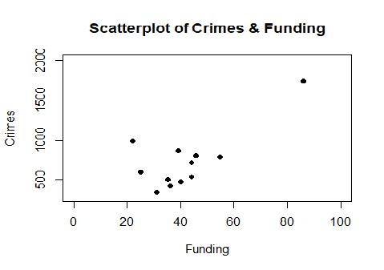
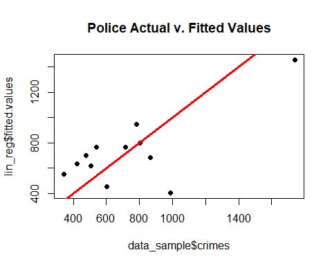
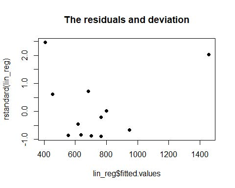
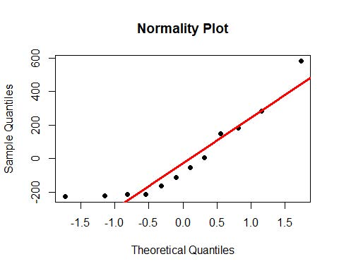
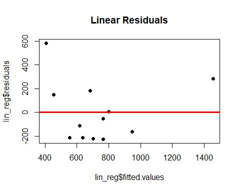

# Linear Regression Crime Prediction
 
## Problem Statement
Using a random number seed, take a random sample of 12 cases from the master data and build a Simple Linear Regression Model in R and answer the following questions.

Dataset can be found here: [Crime Data](Data/)

## Business Questions
1. Calculate and report the correlation coefficient between the two variables. Report and interpret the p values for the correlation coefficients.
2. Create a scatterplot of the data. Show police funding on the x-axis and reported crimes per 100,000 on the y-axis. x-axis is scaled between 0 and 100 and the y-axis is scaled between 300 and 2000.
3. Conduct a simple linear regression on the data with reported crimes per 100,000 as the dependent variable and police funding as the independent variable. As a part of this:
	1. Report the beta coefficients and associated p values and confidence intervals from your model.
	2. Assess model’s conformance with the LINE assumptions of regression.
	3. For a given small city spending $41 per resident on police protection use your model to predict crime rate per 100,000 residents. Include a 95% prediction interval and an interpretation of both the prediction and the accompanying interval. If looked at this interval, what would it potentially indicate about model fit?
4. New York City’s budgeted police expenditures in 2020 are $10.9 billion. Its estimated population for the same year is approximately 8,550,000. Give two reasons why it would be wrong to use this model to predict New York’s crime rate per 100,000 residents.

## Analysis
**Ask-1** 
The correlation coefficient (R) is 0.73. This tells us that there is a strong uphill positive linear relationship. P-value is 0.007, which tells us there is a noticeable relationship between the variables.

**Ask-2** 

Based on the scatterplot above, there seems to be a linear relationship but that’s because of a single odd point far out. That might pull the regression line towards itself. But overall there is a linear relationship.

**Ask-3** 
**Reporting Metrics** 
- The estimated B0 – Coefficient [Intercept] = 45.06 and B1 – Coefficient [Slope] = 16.3. For the intercept the p-value is 0.83. This states we failed to reject the null, so the B0 could be zero or could be any value. For slope intercept p-value is 0.006. Here we can reject the null and conclude the B1 is a positive value.
- The Regression Equation is y [Crimes] = 45.603 + 16.391*Funding.
- The R-sq is 0.53, that means X explains about 53% of variation in Y.
- There is a direct proportionality between the two variables.
- The CI of Intercept is [-437.1, 528], which is a broad range so we cannot rely on this estimate. The CI of Slope is [5.6, 27.1], still a broad range. Even though we reject the bull hypothesis here, we cannot rely on the estimates here.

**L.I.N.E. Assumptions** 
**Linearity**

Data follows linearity but a single outlier pulled the regression line towards itself. There is a positive liner relationship.

**Independence**

The fitted vales with their residuals show no pattern and is random. So, it qualifies the Independence test.

**Normality**

From the plot the data almost follows a normal distribution but there are few values out in the tails.

**Equality of Variances**

We have an abrupt scattering across the plot. But, we do not have any pattern. So, it satisfies the equality of variance.

**Problem** 
Now based on the value, the estimated y value comes out to 717 cases per million, with wide range on the upper and lower limit. The fit is not usable just because of the wide CI range.

**Ask-4** 
- New York City’s budgeted police expenditures in 2020 are $10.9 billion. Its estimated population for the same year is approximately 8,550,000. Reasons that this model doesn’t fit:
	1. The value of the intercept could be zero or any other value, stating we cannot use the estimated intercept, which is a constant for our predictions.
	2. With a sample size of just 12, we cannot estimate the crimes per million. Its just a very small dataset to predict something this crucial. We also are missing a couple more variables for our estimations.
	
## Conclusion
This project on regression helped me to understand how to solve a simple regression problem and get a general idea on all the steps involved like exploratory data analysis (EDA), checking correlations, regression analysis, checking for L.I.N.E. assumptions, solving business queries etc.